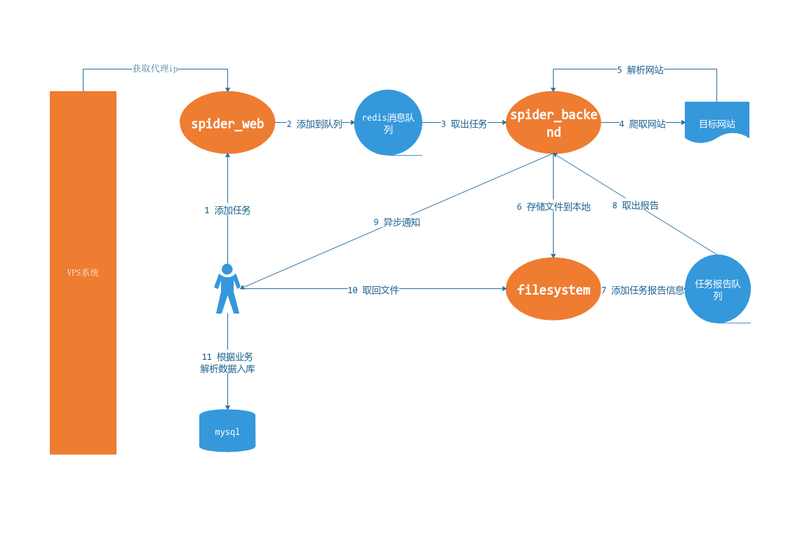

<!-- more -->

<hr />

## 一、业务目标
当时的业务目标是爬取某网站的信息，日爬取量是达到500w，提供的机器是３台linux机器。经过相应的优化之后，单台机器就达到了日均爬取量300万的目标，超额完成业务指标，后来还基于此爬虫替换了公司旧有的通用爬虫系统。废话不多说，下面开始介绍单机300万爬取量爬虫的实现。
## 二、技术选型
- 开发语言: python3.5
- 项目环境: ubuntu16.04
- 消息队列: redis
- 集群配置: etcd
- 数据库: mysql
- requirement.txt

```python
Flask_RESTful==0.3.6
pymongo==3.6.0
python_etcd==0.4.5
tornado==4.5.3
urllib3==1.22
redis==2.10.6
PyMySQL==0.8.0
jsonschema==2.6.0
requests==2.18.4
Flask==0.12.2
beautifulsoup4==4.6.0
lxml==4.1.1
PySocks==1.6.8
```

## 三、项目架构

### 1.项目子系统
#### vps系统
##### 主要功能
该系统是公司开发的vps代理系统，其中vps是购买的国内的代理，系统实现的功能是vps自检，每次请求都会返回可用的代理ip，即高可用ip代理池系统。
#### spider_web
该系统主要对外提供接收任务接口，接收到爬虫任务后放入redis任务队列。
#### spider_backend
该系统是爬虫后台，从任务队列取出任务后通过requests模块获取目标网站内容，存储到本地，并将任务结果放入报告队列回调给任务接收系统。系统采用多进程＋多线程＋多节点增加任务处理量。
#### filesystem
该系统主要用于处理文件下载，任务报告回调给任务发送系统后，就从该系统获取文件，采用tornado+携程的架构提高下载并发量。

## 四、项目优化
### 1.etcd解决微服务配置同步共享问题
因为项目中有三个微服务，且爬虫后台还需要可扩展多节点，那么项目的配置同步与共享就成了一个问题。etcd和可视化界面etcd_browser都是从docker　hub上下载的镜像部署的，非常方便快捷。
### 2.vps资源复用降低请求vps系统的频率
因为公司vps系统是5分钟切换一次ip，且每次请求返回的vps数量仅有100个左右，对于500万每天（3400请求数/min）的并发量，远远不够，即便频繁请求，vps系统也是抗不住的。这就意味着vps复用问题，需要我们自己维护一个队列来复制这100个vps填充ip池,每10s间隔再请求下一次，替换队列的ip，达到资源复用的目的。
### 3.利用多user_agent+随机ip降低失败机率
了解爬虫的都知道，爬虫其中比较难解决的问题就是网站的反爬机制。通常的反爬策略有以下几种:
1. 携带cookie(一般需要后续连续请求的时候采用)
2. 伪造请求头(一般是伪造user_agent)
3. 随机ip(即vps代理)
4. 正常的请求间隔(通常3s以上)

每一个user_agent代表一种浏览器,一个ip代表一种请求地址，采用随机user_agent+随机ip的组合就可以模拟多用户的浏览行为，降低请求失败发生的概率。

## 五、总结
其实还有很多的技术细节没有介绍到，后续的博客内容会围绕该爬虫系统展开来讲。如果您有什么问题，欢迎通过博文底部的评论系统向小桂子提问，大家互相交流学习，共同进步。
