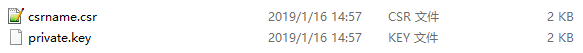
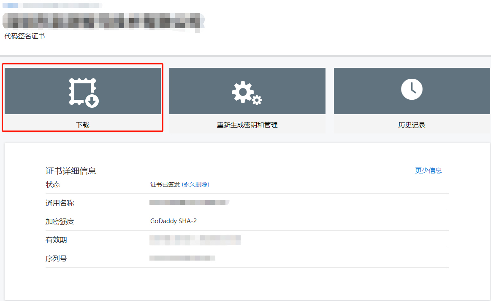
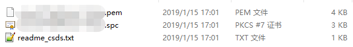
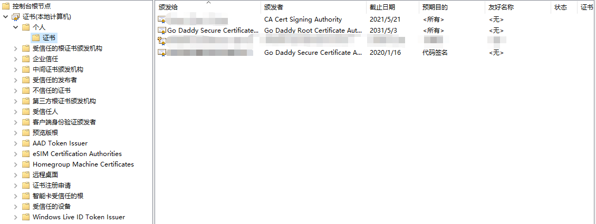
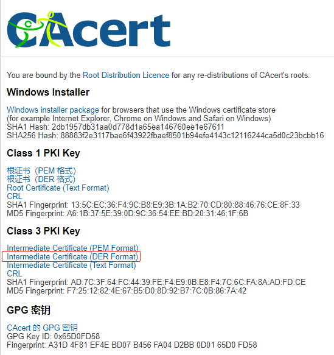
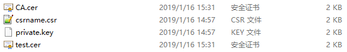
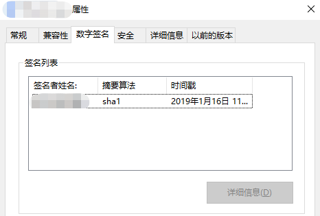

## 一、前期准备
1. git
2. openssl
3. CA根证书
4. Signtool([Signtool介绍和下载传送门](https://docs.microsoft.com/en-us/windows/desktop/seccrypto/signtool "Signtool安装传送门"))

## 二、生成CSR
[CSR百度百科传送门](https://baike.baidu.com/item/CSR/5195886 "CSR")

1.打开git bash
2.输入命令生成私钥和CSR文件
```bash
openssl req -new -SHA256 -newkey rsa:2048 -nodes -keyout private.key -out csrname.csr -subj "/C=CN/ST=Guangdong/L=Shenzhen/O='company_name_en'/OU=IT Dept/CN=domain"
```
参数解释：

| 参数 |  样例 | 解释 |
|:------------:|:------------:|:------------:|
| req | - | PKCS10 X.509证书签名请求（CSR）管理 |
| -new | -SHA256 | 以算法sha256申请 |
| -newkey | rsa:2048 | 以RAS算法生成2048位私钥 |
|-nodes|-|不加密私钥|
|-keyout|private.key|私钥生成路径|
|-out|csrname.csr|申请证书路径|
|-subj| - | 申请人基本信息 |
|C| CN |GB，国家|
|ST| Guangdong |Test State or Province，省|
|L| Shenzhen | Test Locality，地区|
|O| company_name_en | Organization Name，公司名 |
|OU| IT Dep | Organizational Unit Name，部门|
|CN| www.xxx.com | Common Name，通用名 |
|emailAddress|-|邮箱||

3.检查有以下两个文件


## 三、购买证书
[godaddy官网传送门](https://sg.godaddy.com/zh/offers/domains/godaddy-b/cnfos "godaddy官网传送门")

以下步骤按照官网提示来即可，如果遇到不懂的，请致电中国客服：400-842-8288（客服小姐姐很用心）：

1. 填写CSR
2. 提交企业认证资料

## 四、导入证书
### 下载证书
认证成功后，进入godaddy产品页，可看到如下界面：

点击下载即可，解压后会有以下文件：


### 导入证书
1. 按键 **win+R**, 输入 **mmc**, 打开**Microsoft管理控制台**
2. 依次点击**文件->添加/删除管理单元**
3. 左边找到证书，选择添加后，选择**计算机账户**，点击下一步，选择**本地计算机**，确定
4.  展开 **证书（本地计算机）**, 选择**个人**.
5.  右键 **证书**, 菜单中选择: **所有任务** > **导入**，点击下一步
6.  **浏览** 找到下载的zip文件里的`SPC`文件—如果浏览时没有, 记得改变筛选文件类型为**PKCS #7 Certificates (*.spc, *.p7b)**
7.  在证书导入向导界面，选择**将所有的证书都放入下列存储**确保类型为**个人**.
8.  点击**完成**

此时，个人-证书里就出现我们购买好的证书了。


## 五、应用签名
### 安装CA根证书
[CA根证书主页传送门](http://www.cacert.org/index.php?id=3 "CA根证书主页传送门")
1. 下载DER格式

2. 安装证书
与安装godaddy证书步骤一致。

### 导出代码证书和CA根证书
1. 打开**Microsoft管理控制台**
2. 展开**证书（本地计算机）->个人->证书**, 在刚刚导入的代码证书上右键
3. 菜单依次选择**所有任务->导出**
4. 选择**BASE64**编码
5. 选择导出的路径
6. 完成

CA根证书导出同上。

### 生成PFX证书
1. 生成前，检查有以下四个文件：

两份证书文件，一份申请证书文件，一份秘钥

2. 打开git bash,执行以下命令
```bash
openssl pkcs12 -export -in test.cer -inkey private.key -certfile CA.cer -passout pass:yourpassword -out certificate.pfx
```

3. 检查是否有certificate.pfx文件

### 应用签名
1. 打开git bash,执行以下命令
```bash
SignTool sign /f certificate.pfx /p yourpassword /tr http://tsa.starfieldtech.com /td SHA256 your_exe.exe
```

2. 检查exe属性


大功告成！
